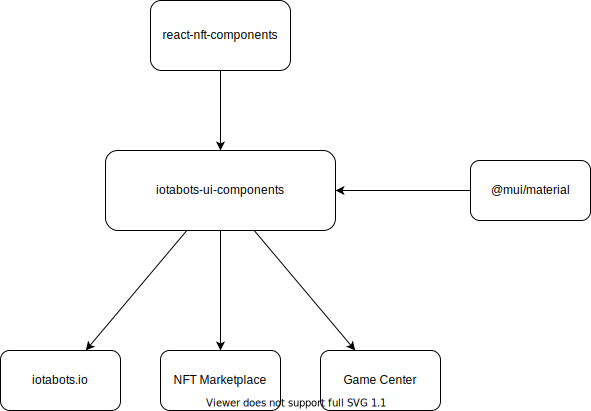

# React NFT Components

> This repository owns the code of the [@iotabots/react-nft-components](https://www.npmjs.com/package/@iotabots/react-nft-components) NPM module.


## Architecture




## Development

Clone the repository and install the dependencies.

```bash
git clone https://github.com/iotabots/nft-ui-components
cd nft-ui-components
yarn install
```

Start storybook and open the browser (http://localhost:6006)

```bash
yarn run storybook
```